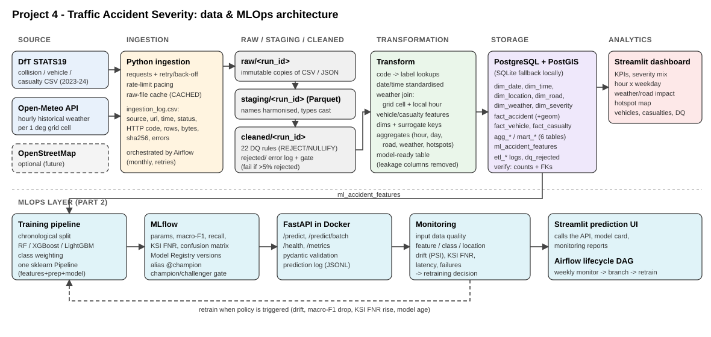

# Project 4 – Part 1: Traffic Accident Analytics Data Pipeline

This pipeline combines the UK DfT **STATS19** road-collision data (2023–2024) with hourly **Open-Meteo** weather. It processes the data through raw → staging → cleaned → analytical layers, loads a star-schema warehouse into **PostgreSQL/PostGIS**, and serves a **Streamlit** dashboard. **Apache Airflow** orchestrates the run. The same steps can also be run from a single CLI command, which is the "approved equivalent" workflow.



## What's included (mapped to the submission package)

| # | Required item | Where |
|---|---|---|
| 1 | Source code and ETL scripts | `src/traffic_pipeline/` (`extract.py`, `staging.py`, `quality.py`, `transform.py`, `marts.py`, `load.py`, `cli.py`) |
| 2 | Airflow DAG | `dags/traffic_accident_etl_dag.py` (monthly, 10 tasks, retries) |
| 3 | Database schema and sample populated tables | `sql/schema_postgres.sql`, `src/traffic_pipeline/warehouse_schema.py`, `docs/execution_evidence/warehouse_tables_sample.md` |
| 4 | Dataset source and access instructions | `docs/data_sources.md` |
| 5 | Architecture diagram and pipeline flow | `docs/architecture.svg`, `docs/report.docx` §3 |
| 6 | Data dictionary and validation rules | `docs/data_dictionary.md` (generated from the schema), `docs/validation_rules.md` |
| 7 | Streamlit application | `dashboard/app.py` (6 tabs, 6 KPIs, filters) |
| 8 | Project report | `docs/report.docx` |
| 9 | Execution evidence | `docs/execution_evidence/` (console log, run log, ingestion log, quality summary, rejected records, table samples, dashboard screenshot). |
| 10 | README | this file |

## Project layout

```
part1_data_pipeline/
├── dags/traffic_accident_etl_dag.py     Airflow DAG
├── src/traffic_pipeline/                pipeline package (one module per layer)
├── dashboard/app.py                     Streamlit dashboard
├── sql/schema_postgres.sql              generated PostgreSQL/PostGIS DDL
├── scripts/export_schema_and_dictionary.py
├── docker/                              Airflow + dashboard images, DB init
├── docker-compose.yml                   PostGIS + Airflow + dashboard
├── tests/                               pytest unit tests
├── docs/                                report, diagram, dictionary, rules, evidence
└── data/  (created at run time, git-ignored)
    ├── raw/<source>/<run_id>/           immutable source copies
    ├── staging/<run_id>/                typed Parquet
    ├── cleaned/<run_id>/                validated Parquet
    ├── rejected/<run_id>/               rejected_records.csv + quality_summary.json
    ├── analytics/<run_id>/ and latest/  star schema, marts, model-ready table
    ├── warehouse/traffic_warehouse.db   SQLite fallback warehouse
    └── logs/                            ingestion_log.csv, run_log.csv, pipeline.log
```

## Option A – run locally (no Docker; uses SQLite)

Requires Python 3.10+.

```bash
python -m venv .venv
```
```bash
.venv\Scripts\activate
```
(use `source .venv/bin/activate` on macOS/Linux)
```bash
pip install -r requirements.txt
```
```bash
pip install -e .
```
```bash
traffic-pipeline run
```
```bash
streamlit run dashboard/app.py
```

* The first full run downloads about 180 MB from DfT and makes about 12 paced weather API calls. It takes about 10 minutes, mostly waiting on the weather quota. Later runs reuse the raw files (status `CACHED`) and finish in about 2 minutes.
* For a quick demo, add `--max-collisions 20000` to draw a reproducible sample, or `--skip-weather` to skip the API calls.
* Each step can also be run on its own, as Airflow does: `traffic-pipeline step transform --run-id <run_id>`.

## Option B – full stack with Docker (PostgreSQL/PostGIS + Airflow)

```bash
cp .env.example .env
```
Edit the passwords in `.env`, then:
```bash
docker compose up -d --build
```

* Airflow: http://localhost:8080. Log in with `AIRFLOW_ADMIN_USER` / `AIRFLOW_ADMIN_PASSWORD` from `.env`, then trigger **traffic_accident_etl**.
* Dashboard: http://localhost:8501. It reads from PostGIS.
* PostGIS: `localhost:5432`, database `traffic_dw`. After each load, `fact_accident.geom` and `mart_location_hotspots.geom` are added with a GiST index. Example query: `SELECT COUNT(*) FROM fact_accident WHERE ST_DWithin(geom::geography, ST_MakePoint(-0.1276,51.5072)::geography, 2000);`

To run the CLI on your machine against the Docker database, set `DATABASE_URL=postgresql+psycopg2://traffic:<password>@localhost:5432/traffic_dw` in `.env`.

## Configuration (environment variables / `.env`)

| Variable | Default | Meaning |
|---|---|---|
| `DATABASE_URL` | SQLite file under `data/warehouse/` | warehouse connection (credentials only ever come from env) |
| `STATS19_YEARS` | `2023,2024` | years to extract |
| `MAX_COLLISIONS` | `0` (all) | reproducible sample size |
| `FORCE_DOWNLOAD` | `false` | ignore cached raw files |
| `WEATHER_ENABLED` | `true` | turn the Open-Meteo enrichment on or off |
| `WEATHER_GRID_DEG` | `1.0` | weather grid resolution |
| `MAX_REJECT_RATE` | `0.05` | quality gate threshold |

## Tests

```bash
pytest
```
Covers the validation rules, the weather join, banding, surrogate keys, the calendar dimension, the code lookups and step wiring. The DAG-structure test runs when Airflow is installed.

## Re-generating the schema DDL and data dictionary

```bash
python scripts/export_schema_and_dictionary.py
```

## Verified run (this repository)

Run `20261007T050603Z` processed all of 2023–2024. It extracted 839,763 raw rows and 117 weather cell-years (1,026,312 hourly readings, 0 failed requests). Data-quality checks rejected 46 records: 12 collisions without coordinates and 34 orphaned child rows. The run loaded 205,173 collisions, 373,308 vehicles and 261,236 casualties. Weather was matched to 100 % of collisions, and all 16 tables passed the load verification. See `docs/execution_evidence/`.
