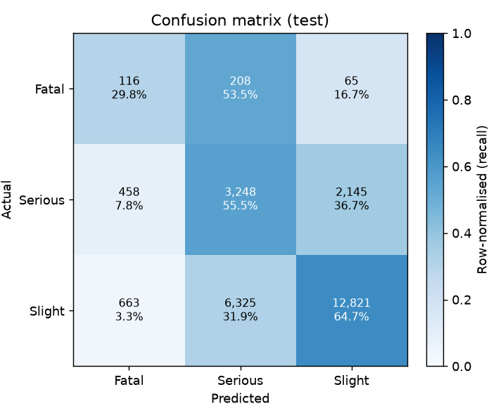

# Traffic Accident Severity – Part 2 Report: MLOps Pipeline

**Student:** _<your name / ID>_

## 1. Problem
The model predicts collision severity (Fatal / Serious / Slight) from information known when the collision is reported. The input is the Part 1 table `ml_accident_features` (205,173 collisions, 2023–2024). The classes are highly imbalanced: Slight 75.6 %, Serious 22.9 %, Fatal 1.5 %.

## 2. Model development
* **Split (chronological):** train Jan 2023 – Jun 2024, validation Jul – Sep 2024, test Oct – Dec 2024.
* **Pipeline:** one sklearn `Pipeline`: `AccidentFeatureEngineer` (cyclical time, darkness, wet road, high-speed road, vulnerable road user, …) → `ColumnTransformer` (median imputation, one-hot encoding) → `LGBMClassifier`.
* **Imbalance:** balanced per-sample class weights.

## 3. Results (test period, Oct – Dec 2024)

| Metric | Value |
|---|---|
| Macro-F1 | 0.431 |
| Recall – Fatal / Serious / Slight | 0.298 / 0.555 / 0.65 |
| KSI recall (Fatal + Serious caught) | 0.646 |
| Accuracy | 0.621 |

Accuracy is lower than the 75.6 % you'd get by always predicting "Slight". That is intentional: the class weights trade accuracy for catching serious and fatal collisions, which is the costly error for road safety.

## 4. MLflow, registry and deployment
* Each run logs its parameters, valid/test metrics (macro-F1, per-class recall/precision/F1, KSI false-negative rate), confusion matrices, classification reports, a split summary, the reference profile and the model with its signature.
* Model versions are registered as `traffic-severity-classifier`. The `@champion` alias moves only when a new model beats the champion's test macro-F1. On promotion the model is exported to `models/champion/`.
* The FastAPI service (`/predict`, `/predict/batch`, `/health`, `/model-info`, `/metrics`) validates input with pydantic and logs every request. It is containerised with the `Dockerfile`, and `docker-compose.yml` adds the MLflow server and the Streamlit UI.
* Verified locally: `/predict` returns probabilities, an invalid payload returns 422 and is counted as a failure, and `/metrics` reports latency and error rate.

## 5. Monitoring and retraining
`monitoring.py` compares new data with the training reference profile. It covers input quality, feature PSI, class drift, location drift (police force and centroid), macro-F1, KSI false-negative rate, latency and failures. Retraining criteria are in `docs/model_lifecycle.md`.

| Check | Result |
|---|---|
| Labelled batch (Oct – Dec 2024) | no retraining needed (macro-F1 0.431, stable) |
| Simulated drift (rural, night, wet) | **RETRAIN**: 7 features drifted, location PSI 0.82 |

The reports are in `execution_evidence/`.

## 6. Limitations
Weather is resolved at the 1° grid, which describes regional rather than street-level conditions. Severity also depends on factors that aren't recorded (speed at impact, seatbelt use), which caps achievable performance. Probabilities are not calibrated.
